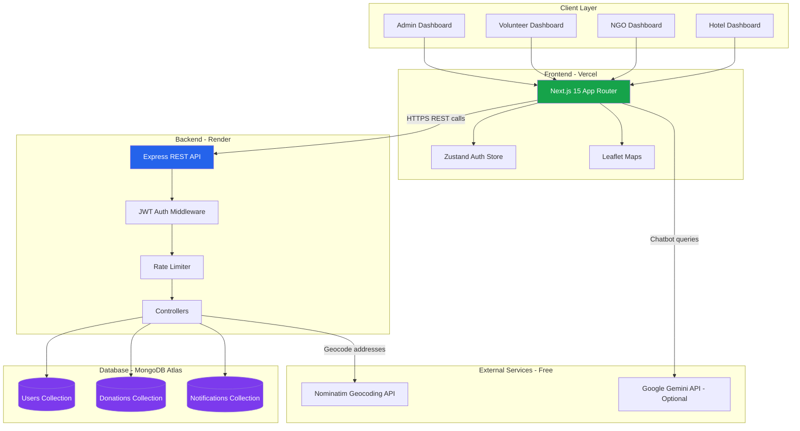
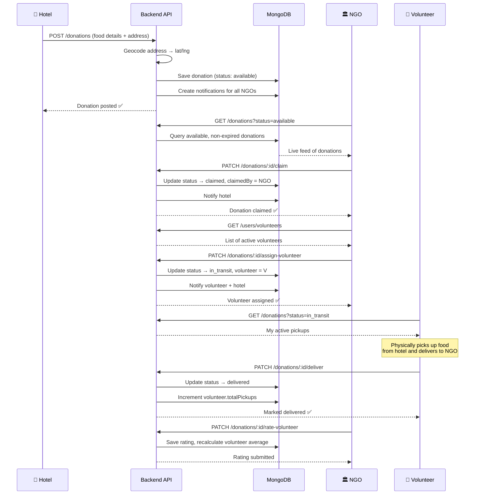
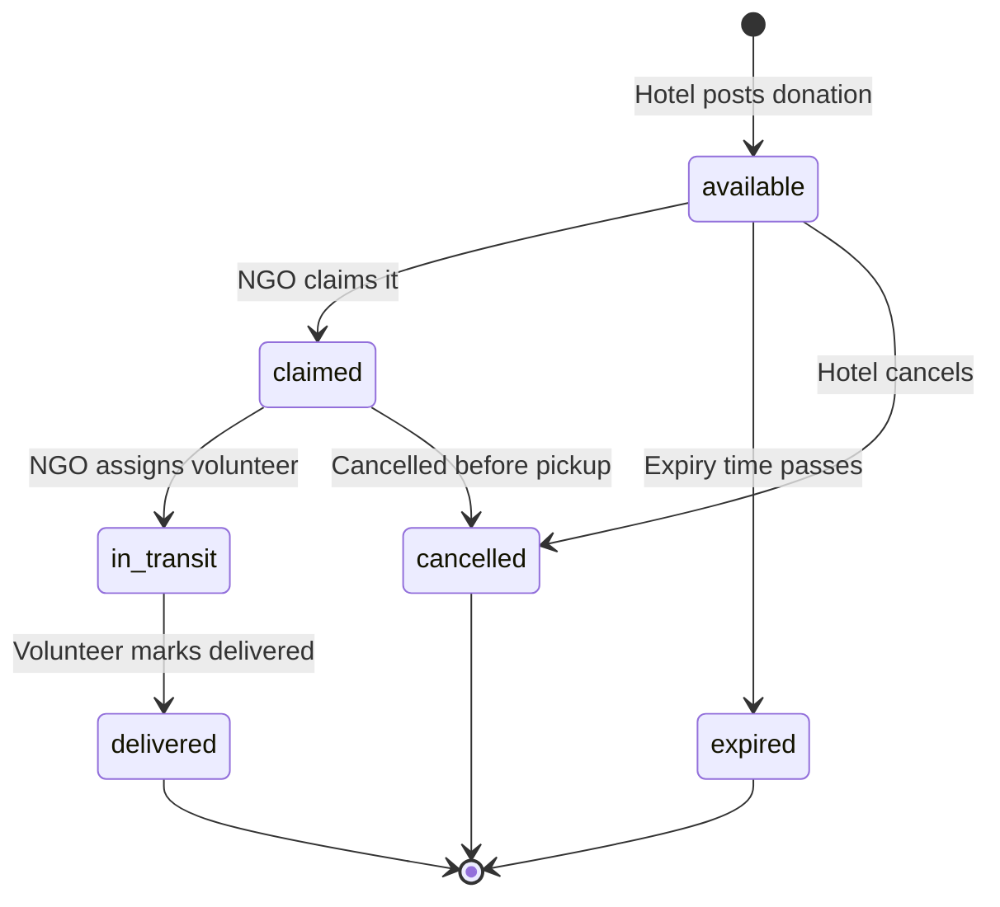

# FoodLink — Smart Food Redistribution Platform

> Connecting surplus food from hotels & restaurants to NGOs and communities in need, with real-time delivery handled by volunteers.

🔗 **Deployed Link:** https://food-link-t.vercel.app

---

## Problem Statement

Every day, hotels and restaurants discard large quantities of surplus, edible food due to overproduction, cancelled events, or buffet leftovers — while NGOs and shelters nearby struggle to source enough food to feed people in need.

The core issues are:
- Lack of real-time coordination
- Limited logistics support
- Time-sensitive food expiry
- Lack of volunteer support 
- Poor visibility into donation impact

---

## Solution

**FoodLink** is a platform that closes this gap with a structured, role-based system:

| Role | What they do |
|---|---|
|  **Hotels/Restaurants** | Post surplus food with quantity, expiry time, and pickup location |
|  **NGOs/Charities** | Browse a live feed, claim donations, and assign volunteers |
|  **Volunteers** | Get assigned pickups, collect food, and deliver it to NGOs |
|  **Admin** | Oversees the entire platform, manages users, and monitors activity |

By combining real-time notifications, automated donation workflows, volunteer coordination, interactive maps, and end-to-end status tracking, FoodLink enables surplus food to be identified, claimed, transported, and delivered efficiently before it expires, while providing transparency and measurable impact for all stakeholders.
---

## Tech Stack

### Frontend
- Next.js 15
- React + TypeScript
- Tailwind CSS
- Leaflet Maps
- Recharts
- Zustand

### Backend
- Node.js
- Express.js
- TypeScript
- MongoDB Atlas
- Mongoose
- JWT Authentication
- Winston

### AI & Deployment
- Google Gemini
- Vercel
- Render

---

## System Architecture



---

## Workflow / Process Flow

### Full Donation Lifecycle



### Donation Status State Machine



### User Role Decision Flow


---

## Features

### Hotel/Restaurant
- Create and manage surplus food donations
- Mark donations as Emergency for priority NGO visibility
- Track donation history 
- View nearby NGOs on map
- Personal impact analytics 

### NGO/Charity
- Live feed of available donations, sorted by expiry urgency
- Claim donations
- Assign volunteers from a ratings-sorted list 
- Map showing donations and other NGOs
- Personal impact analytics 

### Volunteer
- Navigate between pickup and delivery locations
- Mark deliveries complete
- Track pickup history
- Personal impact analytics 

### Admin
- Full user management — activate, suspend, or verify any account
- Platform-wide analytics and charts
- Live map of all activity across the platform

### Shared Features
- AI-powered FAQ assistant
- Real-time notifications
- Live Interactive maps
- Overall Analytics Page

---
## Local Setup Instructions

# Clone repository
```bash
git clone <repo-url>
```

# Backend
```bash
cd backend
npm install
p .env.example .env
```
Open `.env` and fill in your `MONGODB_URI` and JWT secrets.

```bash
npm run seed   # Creates demo accounts and sample data
npm run dev  
``` 

# Frontend
```bash
cd frontend
npm install
cp .env.example .env.local
```
Open `.env.local` and set `NEXT_PUBLIC_API_URL=http://localhost:5000/api/v1`

```bash
npm run dev

Open `http://localhost:3000` in your browser.

```

